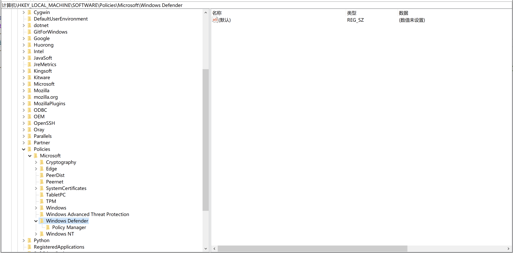

python操作windows下注册表，官方推荐的库是winreg，官方文档在这里：https://docs.python.org/3.8/library/winreg.html#module-winreg

模块winreg中共包含18个操作注册表的函数，分别如下：
关闭键、连接注册表、创建键、删除键、删除值、枚举键、枚举值、扩展环境字符串、刷新键、载入键、打开键、查询键信息、查询值、保存键、设置值、关闭反射键、开启反射键、查询反射键

下面说一下学习这些函数过程中遇到的坑

# 需要先明确一下注册表中的一些概念，否则看文档时混乱搞不清楚
注册表左边的通常称为键、子健 或 项、子项  
注册表右边的通常称为值，包含：值名称、值类型、值数据  
如下图  


# OpenKey、OpenKeyEx（打开键）
```
其中OpenKeyEx是OpenKey的扩展版本，也就是加强版本
函数原型 -> winreg.OpenKeyEx(key, sub_key, reserved=0, access=KEY_READ)
官方文档中有1个坑
第4个参数的介绍是："access is an integer that specifies an access mask that describes the desired security access for the key. Default is KEY_READ. See Access Rights for other allowed values."，没用过这个函数的人，看到这个介绍，会觉得值应该是整数，尝试后发现不是，然后尝试 KEY_READ 发现也不是，最后经过尝试发现是winreg.KEY_ALL_ACCESS

需要注意，第4个参数如果设置不正确，后面写入值的时候，会报错提示权限问题，其中winreg.KEY_ALL_ACCESS是权限最大的，直接设置为它就可以
```

# SetValue、SetValueEx(设置值)
```
其中SetValueEx是SetValue的扩展版本，也就是加强版本
函数原型 -> winreg.SetValueEx(key, value_name, reserved, type, value)
官方文档有2个坑
第1个坑是第2个参数，介绍是："alue_name is a string that names the subkey with which the value is associated."，翻译过来这个参数应该是子健的名字，但其实它应该是值名称，对应上面注册表的概念
第2个坑是第4个参数，介绍是："type is an integer that specifies the type of the data. See Value Types for the available types."，跟OpenKeyEx中的坑类似，值不是整数，是winreg.REG_DWORD

关于第4个参数，一开始我没发现怎么用的时候，用到了一个小技巧，先手动设置注册表的值，然后使用winreg.QueryValueEx读取对应的值，可获取值数据和值类型
```